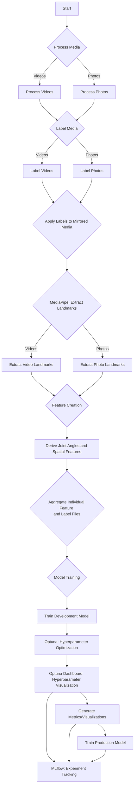

# Aerial Straps Pose Classifier

This project introduces an intelligent solution leveraging the capabilities of machine learning to classify various aerial straps poses captured in photos and videos. Building on the rapid advancements in computer vision, this projectaims to engineer a comprehensive pipeline to process, label, and train models capable of recognizing and categorizing key poses used in aerial straps routines.


# What is Aerial Straps?
From Wikipedia, [aerial straps](https://en.wikipedia.org/wiki/Aerial_straps) "are a type of aerial apparatus on which various feats of strength and flexibility may be performed, often in the context of a circus performance. It is a cotton or nylon web apparatus that looks like two suspended ribbons. Wrapping the strap ends around hands and wrists, the performer performs holds, twists, rolls and manoeuvres, requiring extreme strength and precision similar to men’s rings in gymnastics." 
If you have seen a [Cirque du Soleil](https://www.google.com/url?sa=t&rct=j&q=&esrc=s&source=web&cd=&cad=rja&uact=8&ved=2ahUKEwjTyt32h5aBAxVaFlkFHV7sAhcQFnoECBkQAQ&url=https%3A%2F%2Fwww.cirquedusoleil.com%2F&usg=AOvVaw0VWSr1RfYBuHS09WwR0tD_&opi=89978449) show, you have probably seen an aerial straps performance. There are many examples on [YouTube](https://www.youtube.com/results?search_query=aerial+straps) of course. 
Although many performances involve rapid transitions through poses or more advanced and artistic versions of a pose, there exist specific basic poses identifiable in this art. These poses sometimes overlap with movements from other disciplines such as calisthenics or gymnastics, an example being the "back lever" - a common calisthenics position that is also performed on aerial straps:

|  | 
|:--:| 
| *back lever on aerial straps* |

# Motivation for Project
Having trained in aerial straps for several years and being a data scientist, I envisioned combining this discipline with machine learning technology. This took a tangible form when I experimented with the MediaPipe pose detection model on a video of myself, obtaining promising results. Subsequently, I had the idea to create an aerial straps classification model utilizing MediaPipe for feature extraction. 

This project intends to demonstrates a comprehensive approach to a machine learning project, covering all stages from inception to deployment, which involves tasks such as data collection, data pre-processing, data labeling, exploratory data analysis (EDA), feature creation, model development, evaluation, hyperparameter tuning, and deployment.

## Project Highlights:

- **Data Processing**: Process and prepare media, including videos and photos, to create a dataset ready for analysis.
- **Data Labeling**: Manually label poses like the 'meathook', 'back lever', and 'reverse meathook', among others.
- **Feature Extraction**: Extract critical pose landmarks, create joint angle and spatial relationship features to capture the intricacies of each pose.
- **Model Training**: Train machine learning models, evaluate their performance, and refine them for deployment applications.
   - **Tracking and Evaluation**:
      - **Hyperparameter Optimization**: Leverage the Optuna framework for hyperparameter optimization, utilizing strategies like Bayesian optimization to fine-tune model parameters and achieve optimal performance. 
      - **Optuna Dashboard**: Visualize and analyze the optimization process interactively, gaining insights into hyperparameter relationships and their impact on the model's performance.
      - **MLflow**: Integrate with MLflow for comprehensive experiment tracking, logging details of each optimization trial and facilitating a deeper understanding of the model's behavior over different parameter configurations.

# Project Default Flow Diagram


<br><br>


# Project Details

## 1. Media Processing

### 1.1 Video Processing
To streamline the labeling process, the pipeline provides functionalities to reduce the size of the videos. This ensures quicker loading and processing during the labeling stage. Additionally, the script can produce mirrored versions of the videos. Videos are named the same as the originals but are placed in this different directory to distinguish them.

- **Reduction Factor**: An integer that specifies the factor by which the dimensions of the videos will be reduced. For example, a reduction factor of 4 would reduce both the width and height of the video to 1/4th of their original size.

### 1.2 Photo Processing
Similar to videos, the pipeline also offers a tool for preparing photos for labeling. This involves creating mirrored versions of the images. Mirroring photos can be useful for expanding the dataset and ensuring model robustness.

### Mirroring Media for Enhanced Learning
In the aerial straps discipline, numerous poses involve the performer suspending themselves using a single arm, thereby creating a distinct visual symmetry between poses executed on the left and right arms. A prime example is the meathook pose, which essentially appears as a mirrored version of itself when performed on the alternate arm. Below, you can observe the original and the mirrored renditions of this pose:

|  |  |
|:--:|:--:|
| *original photo of meathook pose* | *mirrored photo of meathook pose* |

Moreover, even poses that utilize both arms for execution are mirrored to augment the dataset. This strategy not only enriches the variety of examples but also leverages the subtle differences between the original and mirrored instances, thereby facilitating a more nuanced understanding for the model. This approach ensures a comprehensive learning from a richer and more diverse dataset, enhancing the model's ability to recognize and differentiate between intricate poses with higher accuracy.


## 2. Labeling

### 2.1 Video Labeling
In this process, each frame of a video is assigned a corresponding label.

#### Steps:
1. **Displaying the Video Frame**:
   - The video frame will be displayed for inspection based on the `skip_seconds` value (in this case, every second). 
   - This assists users in deciding the most appropriate label for the current frame.
  
2. **Key Press Mapping**:
   - Based on the `params.yaml`, we have the following labels and their associated keys:
     - `m`: **meathook**
     - `n`: **nutcracker**
     - `l`: **l-hang**
     - `o`: **other pose or transition**
     - `r`: **reverse meathook**
     - `b`: **back lever**
     - `f`: **front lever**
   - The user is prompted to press the respective key to label the frame. Pressing an unassociated key will result in a reminder of the valid key mappings.

3. **Progress Saving**: 
   - The labeled data is saved in CSV format. 
   - Each row contains the frame number, filename (with "video_" as prefix), and the assigned label.

### **Video Frame Labeling Method Summary**:
The `label_videos` method allows the user to manually label frames from specified videos within a directory. The user is presented with a frame every `skip_seconds` (calculated by number of seconds to skip and frame rate of video) and assigns a label to it. This label is then applied to all frames from the previously labeled frame up to and including the current frame. At the end of the video, the user labels the final frame, and this label is applied to all remaining frames. This table respresents the approach.

**Table**:

| Frame Number Displayed | Pressed Key | Label Assigned | Frames Labeled |
|------------------------|-------------|----------------|----------------|
| 0                      | ‘a’         | Apple          | 0              |
| 5                      | ‘b’         | Banana         | 1,2,3,4,5      |
| 10                     | ‘a’         | Apple          | 6,7,8,9,10     |
| 15                     | 'c'         | Cherry         | 11,12,13,14,15 |
| 20                     | ‘c'         | Cherry         | 16,17,18,19,20 |
| 22                     | 'a'         | Apple          | 21,22          |

**Explanation**: 
In this example, there are 22 frames in total, and `skip_frames` is set to 5. The user is first presented with frame 0 and assigns the label 'Apple'. This label is applied to frame 0. Next, the user is presented with frame 5 and assigns the label 'Banana'. This label is then applied to frames 1 through 5. This process continues until the end of the video. Since the last frame displayed by skipping frames is not the final frame of the video, the user is presented with the final frame (frame 22) and assigns the label 'Apple'. This label is then applied to frames 21 and 22.

These functions make it efficient to label video data for machine learning tasks or other analyses, especially when the videos contain continuous segments with the same characteristics.


### 2.2 Photo Labeling

#### Steps:
1. **Displaying the Photo**: 
   - Each photo is displayed for inspection.

2. **Key Press Mapping**:
   - Same as the video labeling, you'll use the keys mentioned above to label the photos.

3. **Progress Saving**: 
   - The labeled data is saved in CSV format.
   - Each row contains the photo filename (with "photo_" as prefix) and the assigned label.


> **Important Note**: It may be better to run the Labeling part of the code outside of the VS Code integrated terminal, such as in the Mac Terminal. Running video playback and labeling within an integrated terminal like the one in VS Code may lead to issues. You may also need to install some additional packages to support video playback in your terminal environment.

## 3. Mirrored Media Labeling

### Overview:
Once videos and photos are labeled, it's essential to ensure that their mirrored versions also have appropriate labels.

### Steps:
1. **Identifying Mirrored Files**: 
   - The code identifies files in the specified directories that have a "mirrored_" prefix. 
   - It then matches these mirrored files to their original counterparts.

2. **Label Application**: 
   - For every mirrored video or photo, labels from the original file are applied.
   - The filenames in the CSV output for these mirrored files will contain the "mirrored_" prefix to distinguish them from their original counterparts.

3. **Saving Mirrored Labels**: 
   - The mirrored labels are saved in CSV format in the specified output directory.

> **Note**: 
This step is automated and doesn't require manual labeling. It merely applies existing labels to mirrored versions.


## 4. Features

This code extracts pivotal pose landmarks and angles from video frames and photos, optimizing for aerial straps performance analysis. Although there are separate functions for photos and videos to extract landmarks for organization's sake, creating the features from the output is practically the same and performed in one function for both photos and videos.

### Pose Landmark Extraction

Leveraging the [MediaPipe's Pose Landmarker](https://developers.google.com/mediapipe/solutions/vision/pose_landmarker), I extract essential pose landmarks that are particularly significant in aerial straps performances, while excluding less relevant landmarks such as those pertaining to the mouth.

MediaPipe's Pose Landmarker operates through a trained machine learning model to identify key body landmarks, illustrating a simplified yet detailed 2D skeleton representation of a person based on anatomical points.

### 4.1 **Extract Pose Landmarks from Videos**

The `extract_landmarks_for_videos` function is designed to extract the necessary data from video frames:

- **Input**: Compatible with both original and quality-reduced videos.
- **Output**: Generates a unique CSV file for each video, named `video_{video_name}_landmarks.csv`.

### 4.2 **Extract Pose Landmarks from Photos**

To retrieve the required data from photos, use the `extract_landmarks_for_photos` function:

- **Input**: Suitable for high-resolution or down-scaled photos.
- **Output**: Creates a dedicated CSV file for each photo, following the pattern `photo_{photo_name}_landmarks.csv`.

Below is an illustrative example showcasing the extracted landmarks represented as blue dots, with connections drawn between them:

|  | 
|:--:| 
| *landmarks extracted with Mediapipe pose model* |

### 4.3 **Create Features from Pose Landmarks**

#### Joint Angle Features
This step creates joint angle features, calculating various joint angles such as elbow, shoulder, hip, knee, spine, and torso angles from 2D landmark coordinates. The calculate_2d_angle function computes the angle formed by three points (a, b, and c) in a 2D space, with point 'b' being the vertex of the angle. 

Subsequently, the extract_angles function utilizes calculate_2d_angle to determine several specified angles, with landmarks predefined for each angle (e.g., the left elbow angle is defined by the landmarks 'LEFT_SHOULDER', 'LEFT_ELBOW', and 'LEFT_WRIST'). 

Some of the critical joint angles being analyzed:

- **Elbow Angle**: Determined by the shoulder, elbow, and wrist joints.
- **Shoulder Angle**: Formed by the elbow, shoulder, and hip joints.
- **Hip Angle**: Constituted by the shoulder, hip, and knee joints.
- **Knee Angle**: Derived from the angles between the ankle, knee, and hip joints.

#### Spatial Features

Spatial features are crafted through the calculation of relative vertical positions between different pairs of body landmarks, an assessment grounded on their y-coordinates. Essentially, it delineates whether a specific body part, say the left foot, is situated above, at level, or below another landmark, like the left hip.

A critical aspect of this function is setting a 'margin of error,' a parameter that facilitates a realistic classification of the 'level' relationship. Despite the criticality of precision, it is unfeasible to demand an exact match in the y-coordinates to categorize two landmarks as 'level.' This margin, therefore, acts as a buffer, allowing for a practical categorization grounded on extensive manual analysis of numerous photos and videos paired with data evaluation.

The predetermined margin is not universally applicable and may require modifications to accommodate the particularities of diverse datasets. While establishing a relative margin was ruled out, an exception exists for the head-to-shoulder relationship, where a unique margin is employed given its consistently smaller span compared to other relationships.

This function thereby categorizes landmarks into three classifications — 'above,' 'below,' or 'level' — enhancing the understanding of spatial dynamics between body parts. Recognizing whether the 'knee' is elevated compared to the 'hip,' for instance, can be instrumental in pose identification.

To ensure clarity and facilitate easy recognition in the output DataFrame, each spatial feature is prefixed with 'spatial_,' a nomenclature strategy that nurtures intuitive and descriptive column headings. This function is designed to process all csv files appended with `_landmarks` in the input directory.


## 5. Combine Features from all CSV Files

The `combine_csv_files` function consolidates interim feature files with labeled files into a singular CSV. This utility ensures that the extracted features from videos/photos and their corresponding labels are combined in a structured manner, ready for subsequent analysis or model training.

### Functionality
The function reads interim features and labeled files from specified directories and merges them based on the filename and frame number. The merged result, which contains both features and labels, is saved in the final features directory. If any row in the merged DataFrame lacks a matching label, a warning is printed to notify the user with the concerning file. The final DataFrame, which comprises features combined with labels, is saved to the `final_features_directory` with the filename `final_features.csv`.

## 6. Model Training and Evaluation

This section of the project focuses on the training, evaluation, and storage of machine learning models used in image analysis, particularly involving the following elements:

### **XGBoost for Model Training**

At the outset, the project considered a range of machine learning models, as indicated by the `MODEL_MAPPER` configuration. However, as development progressed, it was decided to focus exclusively on [XGBoost](https://xgboost.readthedocs.io/en/stable/) for several reasons:

- **Tabular Data Handling:** the features are derived in a tabular format, a type of data with which XGBoost historically performs well.
- **Categorical Variable Management:** XGBoost can natively manage categorical variables, allowing us to bypass preprocessing steps such as one-hot encoding — a significant advantage given the spatial features in our dataset.
- **Speed and Performance:** XGBoost stands out for its efficiency, a crucial attribute given the iterative nature of model training and hyperparameter tuning.

While we have opted for XGBoost, we retain the flexibility to integrate other algorithms in the future, courtesy of the adaptable `MODEL_MAPPER` configuration.

### 6.1 **Model Training Pipeline**

In this phase of the pipeline, we focus on training the XGBoost classifier to identify different aerial straps poses from the processed features of the input images. The pipeline is structured to offer flexibility and efficiency in the training process, leveraging MLflow for experiment tracking and Optuna for hyperparameter optimization. 

#### **Train Model Function**

The `train_model` script is central to this phase, orchestrating the entire training process. It utilizes the parameters in the `model_training ` section of the `params.yaml` file to control various aspects of the training process, including whether to optimize hyperparameters and whether to train a production model on the full dataset.

#### **MLflow Integration**

The pipeline integrates [MLflow](https://mlflow.org/docs/latest/index.html), a platform developed by Databricks to streamline the machine learning lifecycle, including experimentation, reproducibility, and deployment. This integration is pivotal in managing and tracking the experiments conducted during the model training process. Here are the key features of this integration:

- **Experiment and Run Naming**: MLflow organizes experiments by names and allows for individual runs to be named, aiding in the identification and segregation of different stages of the model training process.
- **Parameter and Metric Logging**: All parameters utilized during the training are logged, providing a detailed record of the settings used in each run. Similarly, the chosen metric for hyperparameter optimization, as well as other evaluation metrics, are logged for each run, facilitating performance tracking and comparison.
- **Artifact Logging**: Artifacts such as Optuna study objects and trained models are logged, offering a structured storage solution for important outputs.
- **Nested Runs**: The pipeline supports nested runs, allowing for a hierarchical organization of the hyperparameter optimization runs within the main run, enhancing the clarity and organization of the experiments.
- **Reproducibility**: MLflow automatically logs the Python environment and the Git commit hash, ensuring full reproducibility of each run. It also aids in packaging the code into a reproducible run environment, making it easier to share with other data scientists or transfer to production.

#### MLflow Dashboard

MLflow UI allows the user to view the results of experiments and any associated metrics and artifacts. Refer to the [docs](https://mlflow.org/docs/latest/quickstart.html#view-mlflow-runs-and-experiments) for more information.

To launch the dashboard, use the command below:

```sh
mlflow ui
```

Example MLflowdashboard:
|  | 
|:--:| 
| *Example MLflow Dashboard* |


#### **Optuna for Hyperparameter Optimization**

When the `optimize_hyperparams` parameter is set to True in the `params.yaml` file, the pipeline leverages [Optuna](https://optuna.readthedocs.io/en/stable/), an open-source  hyperparameter optimization framework known for its efficiency and performance in finding the optimal hyperparameters for machine learning models.

By default, Optuna employs a Bayesian optimization algorithm known as Tree-Structured Parzen Estimator (TPE) to perform hyperparameter optimization. However, it supports a variety of other optimization algorithms, offering flexibility in the optimization process. In our pipeline, we stick to the default TPE algorithm for optimization. The strategies employed by Optuna are broadly categorized into two:

1. Sampling Strategy: This strategy is focused on selecting the best parameter combinations by concentrating on areas where hyperparameters yield better results. The TPE algorithm, which is part of this strategy, works iteratively to find the hyperparameters that maximize the chosen metric, specified in the score_metric parameter in the `params.yaml` file.
2. Pruning Strategy: This strategy leverages early stopping techniques to halt less promising trials early, thereby saving computational resources and time. It includes methods such as Asynchronous Successive Halving, which promotes the most promising trials to undergo more training epochs.

Optuna integrates seamlessly with MLflow, logging details of the optimization process and each trial in the MLflow UI. This not only ensures the optimal performance of the model but also offers detailed insights into how different hyperparameters influence the model's performance, fostering a deeper understanding and fine-tuning capability.

The number of trials in the optimization is controlled by the `num_trials` parameter, and the best parameters found are used to train the final model, ensuring an efficient and optimized model training process. This approach ensures a balance between computational efficiency and model performance, finding the best hyperparameters in a structured and automated manner.

#### **Optuna Dashboard for Visualization**

Optuna also offers a dashboard for a more interactive and visual analysis of the optimization process. The dashboard provides a detailed view of the optimization history, illustrating the influence and relationships of hyperparameters, among other insights.

To launch the dashboard, use the command below, specifying the database where your Optuna study data is stored:

```sh
optuna-dashboard sqlite:///models/dev/xgb/optuna_study.db
```

Some of the features you can explore with the Optuna dashboard:

- **Optimization History**: A graphical representation of the optimization process, helping you visualize the trajectory of the trials over time.
- **Hyperparameter Importances**: A detailed view of the hyperparameters and their respective importances, aiding in understanding which hyperparameters are more influential in optimizing the model's performance.
- **Hyperparameter Relationships**: Insights into how different hyperparameters relate to each other and their collective impact on the model's performance.

An example of the Optuna Dashboard is shown below:

|  | 
|:--:| 
| *Example Optuna Dashboard* |


For a more detailed walkthrough of the visualization features available, refer to the Optuna tutorial on visualization in their [official documentation](https://optuna.readthedocs.io/en/stable/reference/visualization/index.html). The dashboard is an excellent tool for gaining a deeper understanding of the optimization process, facilitating fine-tuning and achieving better model performance.

#### **Production Model Training**

Setting the `train_prod_model` parameter to `True` enables the pipeline to train a production model utilizing the entire dataset. If hyperparameter optimization is activated, the optimized parameters will be used.

The training process is a nested run under the `Main_Pipeline_Run`, making full use of the available data to attain optimal performance. Here is how you can register and manage this production model using MLflow:

1. **Access the MLflow UI**: Navigate to the experiment and run where the production model was trained in the MLflow UI.
   
2. **Locate the Model**: Find the production model in the run details under the "Artifacts" tab.

3. **Register the Model**: Click "Register Model" to start the model registration in the MLflow Model Registry.

4. **Manage Model Versions and Stages**: After registering the model, use the MLflow Model Registry for version management. You can add descriptions to different versions, move them through stages like "Staging" and "Production," and archive them if necessary.

5. **Deployment**: The model is now ready for deployment, with MLflow offering support for a variety of platforms, facilitating a smooth transition from development to production.

This workflow ensures the model is trained with the optimal configuration and readied for deployment efficiently, benefitting from thorough tracking and management via the MLflow UI.


### 6.2 **Evaluation Metrics**

Post training, the pipeline offers functionalities to generate a comprehensive set of evaluation metrics and visualizations to assess the performance of the trained models. These metrics and visualizations are logged as MLFlow artifacts, ensuring they are easily accessible and well-documented for each run. The key functions involved in this process include:

#### **ROC Curves**
The `generate_roc_curves_and_save` function plots and saves ROC (Receiver Operating Characteristic) curves for each class in a multiclass setting. It calculates the false positive rate and true positive rate for each class, and plots them, providing a visualization of the performance of the model for each class. The area under the curve (AUC) for each class is also calculated and logged as an MLFlow metric, providing a quantitative measure of the model's performance.

#### **Precision-Recall Curves**
Utilizing the `generate_pr_curves_and_save` function, precision-recall curves are plotted and saved for each class, offering a visualization of the trade-off between precision and recall for different threshold values, again in a multiclass setting. The area under each curve is calculated, providing a single metric that summarizes the curve.

#### **Visualizations and Metrics**
The `generate_visualizations_and_save_metrics` function creates a variety of visualizations and saves metrics to aid in the evaluation process. This includes generating a confusion matrix to visualize the performance of the model across different classes, and creating a classification report that contains key metrics such as precision, recall, and F1-score for each class. These metrics are logged individually in MLFlow, allowing for detailed tracking of the model's performance across different classes.

#### **Feature Importance Visualization**
The `generate_feature_importance_visualization` function is employed to visualize and understand the importance of different features in the dataset. It creates a bar chart that displays the features ranked by their importance, as determined by the model. This visualization is saved and logged as an MLFlow artifact, providing insights into which features are most influential in the predictions made by the model.

These visualizations, along with various metrics, are logged as artifacts in MLFlow, ensuring a detailed record of the evaluation process is maintained and can be easily accessed and reviewed through the MLFlow UI.


# Pipeline Usage Sequence

### 1. Media Processing
#### 1.1 Process Videos
```bash
python run_pipelines.py --process_videos
```
#### 1.2 Process Photos
```bash
python run_pipelines.py --process_photos
```
### 2. Labeling
#### 2.1 Label Videos

```bash
python run_pipelines.py --label_videos
```
#### 2.2 Label Photos
```bash
python run_pipelines.py --label_photos
```

### 3. Mirrored Media Labeling
```bash
python run_pipelines.py --apply_mirror_labels
```
### 4. Features
#### 4.1 Extract Pose Landmarks from Videos
```bash
python run_pipelines.py --extract_video_landmarks
```
#### 4.2 Extract Pose Landmarks from Photos
```bash
python run_pipelines.py --extract_photo_landmarks
```

#### 4.3 Create Features
```bash
python run_pipelines.py --make_features
```

### 5. Combine Feature CSVs
```bash
python run_pipelines.py --combine_feature_csv
```

### 6. Train Model
```bash
python run_pipelines.py --train_model
```


# Directory Structure

- **/**: Project root directory
  - **README.md**: The top-level README.
  - **requirements.txt**: The requirements file for reproducing the analysis environment.
   - **params.yaml**: Configuration file containing parameters for the various scripts.
  - **Dockerfile**: File to build a Docker image of the project environment.
  - **run_pipelines.py**: Main script to run the pipelines.
  - **data/**: All the data used in this project (raw, interim, processed, and results).
    - **interim/**
    - **processed/**
    - **raw/**
    - **results/**
  - **notebooks/**: exploratory notebooks
  - **models/**: Trained and serialized models
  - **src/**: Source code for use in this project.
    - **data/**: Scripts to process and label data.
    - **features/**: Scripts to create features for modeling.
    - **models/**: Scripts to train models and evaluate.
    - **visualization/**: Scripts to create exploratory visualizations.
