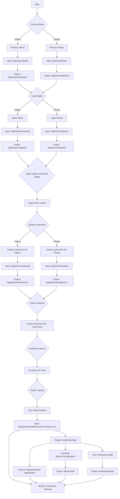

# Aerial Straps Pose Classifier

This project introduces an intelligent solution that harnesses the power of machine learning to accurately classify various aerial straps poses from photos and videos. With the rapid advancements in computer vision, we've engineered a comprehensive pipeline to process, label, and train models that can recognize and categorize key poses used in aerial straps routines.

# What is Aerial Straps?
From Wikipedia, [aerial straps](https://en.wikipedia.org/wiki/Aerial_straps) "are a type of aerial apparatus on which various feats of strength and flexibility may be performed, often in the context of a circus performance. It is a cotton or nylon web apparatus that looks like two suspended ribbons. Wrapping the strap ends around hands and wrists, the performer performs holds, twists, rolls and manoeuvres, requiring extreme strength and precision similar to men’s rings in gymnastics." 
If you have seen a [Cirque du Soleil](https://www.google.com/url?sa=t&rct=j&q=&esrc=s&source=web&cd=&cad=rja&uact=8&ved=2ahUKEwjTyt32h5aBAxVaFlkFHV7sAhcQFnoECBkQAQ&url=https%3A%2F%2Fwww.cirquedusoleil.com%2F&usg=AOvVaw0VWSr1RfYBuHS09WwR0tD_&opi=89978449) show, you have probably seen an aerial straps performance. There are many examples on [YouTube](https://www.youtube.com/results?search_query=aerial+straps) of course. 
Although many of the performances you may see involve the performer moving through poses quickly or doing more advanced or artistic versions of a pose, there are many specific basic poses that can be identified. Some of these poses overlap with other disciplines such as calisthenics or gymnastics, for example the back lever is a common calisthenics position that can also be performed on aerial straps:

|  | 
|:--:| 
| *back lever on aerial straps* |

# Motivation for Project
I've been training aerial straps for a few years, and always thought of combining aerial straps and machine learning. At one point, I saw the MediaPipe pose detection model and tried it out on a video of myself. The results were pretty good. Eventually I had the idea to create an aerial straps classification model using MediaPipe to extract features. This projects also attempts to showcase an ML project from end to end, from conception, data pre-processing, data collection, data labeling, EDA, feature creation, model development, evaluation, hyperparameter tuning and deployment. 

## Project Highlights:

- **Data Processing**: Process and prepare media, including videos and photos, to create a streamlined dataset.
- **Data Labeling**: Distinguish between intricate poses like the 'meathook', 'nutcracker', and 'l-hang', among others.
- **Feature Extraction**: Extract critical pose landmarks, create joint angle and spatial relationship features to capture the intricacies of each pose.
- **Model Training**: Train robust machine learning models, evaluate their performance, and refine them for real-world applications.

# Project Details

## 1. Media Processing

### 1.1 Video Processing
To streamline the labeling process, the pipeline provides functionalities to reduce the size of the videos. This ensures quicker loading and processing during the labeling stage. Additionally, the script can produce mirrored versions of the videos which can be particularly beneficial in scenarios where data augmentation is required. Already processed videos will be skipped. Videos are named the same as the originals but are placed in this different directory to distinguish them.

- **Reduction Factor**: An integer that specifies the factor by which the dimensions of the videos will be reduced. For example, a reduction factor of 4 would reduce both the width and height of the video to 1/4th of their original size.

## 1.2 Photo Processing
Similar to videos, the pipeline also offers a tool for preparing photos for labeling. This involves creating mirrored versions of the images. Mirroring photos can be useful for expanding the dataset and ensuring model robustness.

## 2. Labeling

### 2.1 Video Labeling
In this process, each frame of a video is assigned a corresponding label.

#### Steps:
1. **Displaying the Video Frame**:
   - The video frame will be displayed for inspection based on the `skip_seconds` value (in this case, every second). 
   - This assists users in deciding the most appropriate label for the current frame.
  
2. **Key Press Mapping**:
   - Based on the `params.yaml`, we have the following labels and their associated keys:
     - `m`: **meathook**
     - `n`: **nutcracker**
     - `l`: **l-hang**
     - `o`: **other pose or transition**
     - `r`: **reverse meathook**
     - `b`: **back lever**
     - `f`: **front lever**
   - The user is prompted to press the respective key to label the frame. Pressing an unassociated key will result in a reminder of the valid key mappings.

3. **Progress Saving**: 
   - The labeled data is saved in CSV format. 
   - Each row contains the frame number, filename (with "video_" as prefix), and the assigned label.

### **Video Frame Labeling Method Summary**:
The `label_videos` method allows the user to manually label frames from specified videos within a directory. The user is presented with a frame every `skip_seconds` (calculated by number of seconds to skip and frame rate of video) and assigns a label to it. This label is then applied to all frames from the previously labeled frame up to and including the current frame. At the end of the video, the user labels the final frame, and this label is applied to all remaining frames. This table respresents the approach.

**Table**:

| Frame Number Displayed | Pressed Key | Label Assigned | Frames Labeled |
|------------------------|-------------|----------------|----------------|
| 0                      | ‘a’         | Apple          | 0              |
| 5                      | ‘b’         | Banana         | 1,2,3,4,5      |
| 10                     | ‘a’         | Apple          | 6,7,8,9,10     |
| 15                     | 'c'         | Cherry         | 11,12,13,14,15 |
| 20                     | ‘c'         | Cherry         | 16,17,18,19,20 |
| 22                     | 'a'         | Apple          | 21,22          |

**Explanation**: 
In this example, there are 22 frames in total, and `skip_frames` is set to 5. The user is first presented with frame 0 and assigns the label 'Apple'. This label is applied to frame 0. Next, the user is presented with frame 5 and assigns the label 'Banana'. This label is then applied to frames 1 through 5. This process continues until the end of the video. Since the last frame displayed by skipping frames is not the final frame of the video, the user is presented with the final frame (frame 22) and assigns the label 'Apple'. This label is then applied to frames 21 and 22.

These functions make it efficient to label video data for machine learning tasks or other analyses, especially when the videos contain continuous segments with the same characteristics.


### 2.2 Photo Labeling

#### Steps:
1. **Displaying the Photo**: 
   - Each photo is displayed for inspection.

2. **Key Press Mapping**:
   - Same as the video labeling, you'll use the keys mentioned above to label the photos.

3. **Progress Saving**: 
   - The labeled data is saved in CSV format.
   - Each row contains the photo filename (with "photo_" as prefix) and the assigned label.


> **Important Note**: It is recommended to run the Labeling part of the code outside of the VS Code integrated terminal, such as in the Mac Terminal. Running video playback and labeling within an integrated terminal like the one in VS Code may lead to issues. You may also need to install some additional packages to support video playback in your terminal environment.

## 3. Mirrored Media Labeling

### Overview:
Once videos and photos are labeled, it's essential to ensure that their mirrored versions also have appropriate labels.

### Steps:
1. **Identifying Mirrored Files**: 
   - The code identifies files in the specified directories that have a "mirrored_" prefix. 
   - It then matches these mirrored files to their original counterparts.

2. **Label Application**: 
   - For every mirrored video or photo, labels from the original file are applied.
   - The filenames in the CSV output for these mirrored files will contain the "mirrored_" prefix to distinguish them from their original counterparts.

3. **Saving Mirrored Labels**: 
   - The mirrored labels are saved in CSV format in the specified output directory.

### Note: 
This step is automated and doesn't require manual labeling. It merely applies existing labels to mirrored versions.


## 4. Features

### Overview

This code extracts pivotal pose landmarks and angles from video frames and photos, optimizing for aerial straps performance analysis. Although there are separate functions for photos and videos to extract landmarks for organization's sake, creating the features from the output is practially the same and performed in one function for both photos and videos.

### Pose Landmark Extraction

Utilize [MediaPipe's Pose Landmarker](https://developers.google.com/mediapipe/solutions/vision/pose_landmarker) to derive critical pose landmarks. Not all landmarks are considered; we focus on those pertinent to aerial straps, disregarding ones like the mouth landmark.

#### How MediaPipe Pose Landmarker Works:

MediaPipe's Pose Landmarker detects key body landmarks using a trained machine learning model. The landmarks represent anatomical points, providing a simplified yet robust skeleton of a person in 2D space.

### Joint Angle Features Calculation with Landmarks

Angles between joints or body segments are invaluable for aerial straps posture analysis. The code calculates the angle formed at a vertex between two other points in 2D space. We use the landmark data to derive specific joint angles vital for identifying poses, such as elbow, shoulder, hip, and knee angles.

Some of the extracted joint angle features include:

- **Elbow Angle**: The angle formed between the shoulder, elbow, and wrist joints.
- **Shoulder Angle**: The angle formed between the elbow, shoulder, and hip joints.
- **Hip Angle**: The angle formed between the shoulder, hip, and knee joints.
- **Knee Angle**: The angle formed between the ankle, knee, and hip joints.
- **Spine Angle**: The angle formed between the left hip, right hip, and head landmarks.
- **Torso Angle**: The angle formed between the left hip, right hip, and neck landmarks.

These joint angles provide insights into the body's orientation and can be valuable features for training machine learning models to classify and analyze image data.

### 4.1 **Extract Pose Landmarks from Videos**

Use the `extract_landmarks_for_videos` function to obtain the required data from video frames:

- **Input**: Accepts both original or quality-reduced videos.
- **Output**: Produces a distinct CSV files for every video: `video_{video_name}_landmarks.csv`.


### 4.2 **Extract Pose Landmarks from Photos**

Use the `extract_landmarks_for_photos` function to obtain the required data from photos:

- **Input**: Takes in high-resolution or down-scaled photos.
- **Output**: Outputs one CSV file for every photo: `photo_{photo_name}_landmarks.csv`.

Here is an example of the landmarks (blue dots) extracted with connections drawn between the landmarks:

|  | 
|:--:| 
| *landmarks extracted with Mediapipe pose model* |

### 4.3 **Create Features from Pose Landmarks**

#### Joint Angle Features
This step creates joint angle features, calculating various joint angles such as elbow, shoulder, hip, knee, spine, and torso angles from 2D landmark coordinates. The calculate_2d_angle function computes the angle formed by three points (a, b, and c) in a 2D space, with point 'b' being the vertex of the angle. 

Subsequently, the extract_angles function utilizes calculate_2d_angle to determine several specified angles, with landmarks predefined for each angle (e.g., the left elbow angle is defined by the landmarks 'LEFT_SHOULDER', 'LEFT_ELBOW', and 'LEFT_WRIST'). 

#### Spatial Features
To create 'spatial features', we calculate the relative vertical positions of various pairs of body landmarks using their y-coordinates. In other words, is the left foot above the left hip.

A critical aspect of this function is defining a margin of error when determining the spatial relation. Currently we use 'above','below' or 'level' to characterize the spatial relationship. A margin of error is necessary to realistically categorize the relationship as 'level'. We clearly cannot assume that the hips must be exactly the same y coordinate as the shoulders to be considered 'level' with each other. This magin was established through manual analysis of several photos and videos alongside the data. It's important to note that the chosen margin might not be fully generalizable, and adjustments may be needed based on the specific characteristics of other datasets. It was determined not to be feasible to create any sort of relative margin. However, we do currently define a different margin for the head to shoulder relationship, as it is consistently significantly smaller than the other relationships.

Given a defined margin of error, the function discerns whether one landmark is 'above', 'below', or 'level' with another, helping to identify spatial relationships between different body parts. For instance, understanding if the 'knee' is above, below, or level with the 'hip' may aid in determining the pose. 

Each spatial feature is prefixed with 'spatial_' to craft intuitive and descriptive column names in the final output DataFrame. All csv files in the input folder ending with `_landmarks` will be processed.

## 5. Combine Features from all CSV Files

The `combine_csv_files` function consolidates interim feature files with labeled files into a singular CSV. This utility ensures that the extracted features from videos/photos and their corresponding labels are combined in a structured manner, ready for subsequent analysis or model training.

### Functionality
The function reads interim features and labeled files from specified directories and merges them based on the filename and frame number. The merged result, which contains both features and labels, is saved in the final features directory. If any row in the merged DataFrame lacks a matching label, a warning is printed to notify the user with the concerning file. The final DataFrame, which comprises features combined with labels, is saved to the `final_features_directory` with the filename `final_features.csv`.

Ensure the labeled data is consistent and matches the filenames and frame numbers in the features data. Any inconsistency may result in missing labels for some entries.

## 6. Model Training and Evaluation

This section provides functionalities for training, evaluating, and saving machine learning models for the image analysis task. The main components include:

#### **XGBoost for Model Training**

In the initial stages of this project, there was a provision to incorporate multiple machine learning models for experimentation, as seen in the `MODEL_MAPPER` configuration. However, as the project evolved, the focus narrowed down to exclusively utilizing [XGBoost](https://xgboost.readthedocs.io/en/stable/). XGBoost, or eXtreme Gradient Boosting, is an implementation of gradient boosted decision trees designed for speed and performance. This ensemble method builds multiple decision trees and merges them together to get a more accurate and robust model.

The choice of XGBoost was influenced by several factors. Firstly, despite the origin of the data being images, the features utilized for training are extracted and presented in a tabular format. XGBoost has consistently demonstrated superior performance on tabular data compared to other machine learning models. Secondly, XGBoost can handle categorical variables natively, eliminating the need for preprocessing steps such as one-hot encoding, which would be necessary for other algorithms. This is particularly beneficial in managing the spatial features in this dataset. Additionally, XGBoost is known for its speed and performance, which is critical in the iterative process of model training and hyperparameter optimization.

While the current implementation focuses on XGBoost, the `MODEL_MAPPER` configuration retains the flexibility to integrate additional models in the future, should there be a need to explore other machine learning algorithms. Given these advantages, XGBoost was the chosen algorithm for this project, aligning well with the data characteristics and project requirements, while also leaving room for potential expansions in the future.


### 6.1 **Model Training Pipeline**

In this phase of the pipeline, we focus on training the XGBoost classifier to identify different aerial straps poses from the processed features of the input images. The pipeline is structured to offer flexibility and efficiency in the training process, leveraging MLflow for experiment tracking and Optuna for hyperparameter optimization. 

#### **Train Model Function**

The `train_model` script is central to this phase, orchestrating the entire training process. It utilizes the parameters in the `model_training ` section of the `params.yaml` file to control various aspects of the training process, including whether to optimize hyperparameters and whether to train a production model on the full dataset.

#### **MLflow Integration**

Our pipeline integrates [MLflow](https://mlflow.org/docs/latest/index.html), a platform developed by Databricks to streamline the machine learning lifecycle, including experimentation, reproducibility, and deployment. This integration is pivotal in managing and tracking the experiments conducted during the model training process. Here are the key features of this integration:

- **Experiment and Run Naming**: MLflow organizes experiments by names and allows for individual runs to be named, aiding in the identification and segregation of different stages of the model training process.
- **Parameter and Metric Logging**: All parameters utilized during the training are logged, providing a detailed record of the settings used in each run. Similarly, the chosen metric for hyperparameter optimization, as well as other evaluation metrics, are logged for each run, facilitating performance tracking and comparison.
- **Artifact Logging**: Artifacts such as Optuna study objects and trained models are logged, offering a structured storage solution for important outputs.
- **Nested Runs**: The pipeline supports nested runs, allowing for a hierarchical organization of the hyperparameter optimization runs within the main run, enhancing the clarity and organization of the experiments.
- **Reproducibility**: MLflow automatically logs the Python environment and the Git commit hash, ensuring full reproducibility of each run. It also aids in packaging the code into a reproducible run environment, making it easier to share with other data scientists or transfer to production.

#### **Optuna for Hyperparameter Optimization**

When the `optimize_hyperparams` parameter is set to True in the `params.yaml` file, the pipeline leverages [Optuna](https://optuna.readthedocs.io/en/stable/), an n open-source  hyperparameter optimization software framework known for its efficiency and performance in finding the optimal hyperparameters for machine learning models.

By default, Optuna employs a Bayesian optimization algorithm known as Tree-Structured Parzen Estimator (TPE) to perform hyperparameter optimization. However, it supports a variety of other optimization algorithms, offering flexibility in the optimization process. In our pipeline, we stick to the default TPE algorithm for optimization. The strategies employed by Optuna are broadly categorized into two:

1. Sampling Strategy: This strategy is focused on selecting the best parameter combinations by concentrating on areas where hyperparameters yield better results. The TPE algorithm, which is part of this strategy, works iteratively to find the hyperparameters that maximize the chosen metric, specified in the score_metric parameter in the `params.yaml` file.
2. Pruning Strategy: This strategy leverages early stopping techniques to halt less promising trials early, thereby saving computational resources and time. It includes methods such as Asynchronous Successive Halving, which promotes the most promising trials to undergo more training epochs.

Optuna integrates seamlessly with MLflow, logging details of the optimization process and each trial in the MLflow UI. This not only ensures the optimal performance of the model but also offers detailed insights into how different hyperparameters influence the model's performance, fostering a deeper understanding and fine-tuning capability.

The number of trials in the optimization is controlled by the `num_trials` parameter, and the best parameters found are used to train the final model, ensuring an efficient and optimized model training process. This approach ensures a balance between computational efficiency and model performance, finding the best hyperparameters in a structured and automated manner.

#### **Production Model Training**

The production model training is a crucial step in preparing the model for real-world applications, ensuring it delivers the best performance when deployed. This is facilitated by setting the `train_prod_model` parameter to `True`, instructing the pipeline to train a production model using the entire dataset available, inclusive of the optimized hyperparameters if the optimization process was enabled.

This production model training is executed as a separate run nested under the `Main_Pipeline_Run`, leveraging the full extent of the data to guarantee the highest level of performance. The detailed steps to register and manage this production model through MLflow are as follows:

1. **Access the MLflow UI**: Start by navigating to the specific run in the MLflow UI where the production model was trained.
   
2. **Locate the Model**: Within the run details, find the production model under the "Artifacts" tab.

3. **Register the Model**: Click on "Register Model" to initiate the registration of the model in the MLflow Model Registry.

4. **Manage Model Versions and Stages**: Post registration, the MLflow Model Registry allows for detailed management of the model versions. You can annotate different versions with descriptions, transition them through various stages such as Staging and Production, and archive them when necessary.

5. **Deployment**: Once the model is registered and properly annotated, it is ready for deployment. MLflow supports deployment across various platforms, ensuring a smooth transition from development to production.

By following this structured approach, you not only ensure that your model is trained with the best possible configuration but also facilitate a streamlined process for moving from model training to deployment, with detailed tracking and management through the MLflow UI. This ensures readiness for real-world applications, with the highest level of performance backed by a comprehensive training and optimization process.

#### **Parameters**

The parameters in the `params.yaml` file offer control over various aspects of the training pipeline, including:

- **MLflow Configuration**: Setting the experiment name and defining different run names for various stages of the training process.
- **Model Type**: Specifying the type of model to train (`xgb` in this case).
- **Data Filepath**: Defining the path to the CSV file containing the final features used for training.
- **Test Size**: Setting the fraction of the data to be used as the test set during the training-validation split.
- **Target Column**: Specifying the column in the dataset that contains the target labels.
- **Predictions Directory**: Setting the directory where the predictions will be saved.
- **Hyperparameter Optimization**: Controlling whether to perform hyperparameter optimization and setting the number of trials for optimization.
- **Score Metric**: Defining the metric to guide the hyperparameter optimization process.
- **Production Model Training**: Controlling whether to train a production model on the full dataset.

By adjusting these parameters, you can tailor the training process to meet specific requirements and experiment with different settings to find the most effective approach.

### 6.2 **Generating Evaluation Metrics**

Post training, the pipeline offers functionalities to generate a comprehensive set of evaluation metrics and visualizations to assess the performance of the trained models. These metrics and visualizations are logged as MLFlow artifacts, ensuring they are easily accessible and well-documented for each run. The key functions involved in this process include:

#### **ROC Curves**
The `generate_roc_curves_and_save` function plots and saves ROC (Receiver Operating Characteristic) curves for each class in a multiclass setting. It calculates the false positive rate and true positive rate for each class, and plots them, providing a visualization of the performance of the model for each class. The area under the curve (AUC) for each class is also calculated and logged as an MLFlow metric, providing a quantitative measure of the model's performance.

#### **Precision-Recall Curves**
Utilizing the `generate_pr_curves_and_save` function, precision-recall curves are plotted and saved for each class, offering a visualization of the trade-off between precision and recall for different threshold values, again in a multiclass setting. The area under each curve is calculated, providing a single metric that summarizes the curve.

#### **Visualizations and Metrics**
The `generate_visualizations_and_save_metrics` function creates a variety of visualizations and saves metrics to aid in the evaluation process. This includes generating a confusion matrix to visualize the performance of the model across different classes, and creating a classification report that contains key metrics such as precision, recall, and F1-score for each class. These metrics are logged individually in MLFlow, allowing for detailed tracking of the model's performance across different classes.

#### **Feature Importance Visualization**
The `generate_feature_importance_visualization` function is employed to visualize and understand the importance of different features in the dataset. It creates a bar chart that displays the features ranked by their importance, as determined by the model. This visualization is saved and logged as an MLFlow artifact, providing insights into which features are most influential in the predictions made by the model.

These visualizations, along with various metrics, are logged as artifacts in MLFlow, ensuring a detailed record of the evaluation process is maintained and can be easily accessed and reviewed through the MLFlow UI.

# Project Flow Diagram


# Usage Sequence

### 1. Media Processing
#### 1.1 Process Videos
```bash
python run_pipelines.py --process_videos
```
#### 1.2 Process Photos
```bash
python run_pipelines.py --process_photos
```
### 2. Labeling
#### 2.1 Label Videos

```bash
python run_pipelines.py --label_videos
```
#### 2.2 Label Photos
```bash
python run_pipelines.py --label_photos
```

### 3. Mirrored Media Labeling
```bash
python run_pipelines.py --apply_mirror_labels
```
### 4. Features
#### 4.1 Extract Pose Landmarks from Videos
```bash
python run_pipelines.py --extract_video_landmarks
```
#### 4.2 Extract Pose Landmarks from Photos
```bash
python run_pipelines.py --extract_photo_landmarks
```

#### 4.3 Create Features
```bash
python run_pipelines.py --make_features
```

### 5. Combine Feature CSVs
```bash
python run_pipelines.py --combine_feature_csv
```

### 6. Train Model
```bash
python run_pipelines.py --train_model
```


# Directory Structure

```
├── README.md          <- The top-level README for developers using this project.
├── data
│   ├── raw            <- The original, immutable data dump.
│   ├── interim        <- Intermediate data that has been transformed.
│   ├── processed      <- The final, canonical data sets for modeling.
│   └── results        <- results
│
│
├── models             <- Trained and serialized models, model predictions, or model summaries
│
├── notebooks          <- Jupyter notebooks. Naming convention is a number (for ordering),
│                         the creator's initials, and a short `-` delimited description, e.g.
│                         `1.0-jqp-initial-data-exploration`.
│
├── requirements.txt   <- The requirements file for reproducing the analysis environment
│
├── src                <- Source code for use in this project.
│   ├── __init__.py    <- Makes src a Python module
│   │
│   ├── data           <- Scripts to download or generate data
│   │   └── load_dataset.py
│   │
│   ├── features       <- Scripts to turn raw data into features for modeling
│   │   └── make_features.py
│   │
│   ├── models         <- Scripts to train models and then use trained models to make
│   │   │                 predictions
│   │   ├── predict_model.py
│   │   └── train_model.py
│   │
│   └── visualization  <- Scripts to create exploratory and results oriented visualizations
│       └── visualize.py
│
└──params.yml          <- parameters 
```
