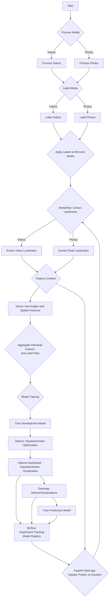
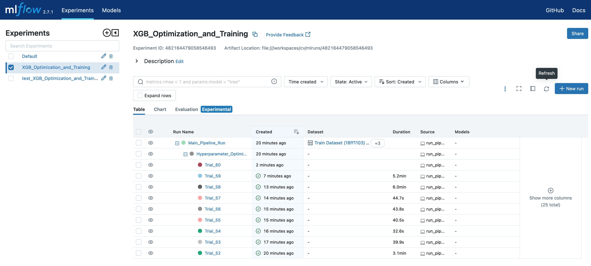
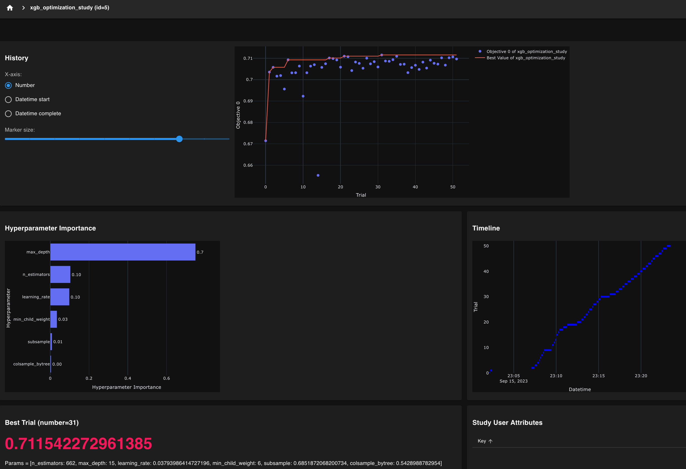

# Aerial Straps Pose Classifier

This project introduces an intelligent solution leveraging the capabilities of machine learning to classify various aerial straps poses captured in photos and videos. Building on the rapid advancements in computer vision, this projectaims to engineer a comprehensive pipeline to process, label, and train models capable of recognizing and categorizing key poses used in aerial straps routines.

# What is Aerial Straps?
From Wikipedia, [aerial straps](https://en.wikipedia.org/wiki/Aerial_straps) "are a type of aerial apparatus on which various feats of strength and flexibility may be performed, often in the context of a circus performance. It is a cotton or nylon web apparatus that looks like two suspended ribbons. Wrapping the strap ends around hands and wrists, the performer performs holds, twists, rolls and manoeuvres, requiring extreme strength and precision similar to men’s rings in gymnastics." 
If you have seen a [Cirque du Soleil](https://www.google.com/url?sa=t&rct=j&q=&esrc=s&source=web&cd=&cad=rja&uact=8&ved=2ahUKEwjTyt32h5aBAxVaFlkFHV7sAhcQFnoECBkQAQ&url=https%3A%2F%2Fwww.cirquedusoleil.com%2F&usg=AOvVaw0VWSr1RfYBuHS09WwR0tD_&opi=89978449) show, you have probably seen an aerial straps performance. There are many examples on [YouTube](https://www.youtube.com/results?search_query=aerial+straps) of course. 
Although many performances involve rapid transitions through poses or more advanced and artistic versions of a pose, there exist specific basic poses identifiable in this art. These poses sometimes overlap with movements from other disciplines such as calisthenics or gymnastics, an example being the "back lever" - a common calisthenics position that is also performed on aerial straps:

|  | 
|:--:| 
| *back lever on aerial straps* |

# Motivation for Project
Having trained in aerial straps for several years and being a data scientist, I envisioned combining this discipline with machine learning technology. This took a tangible form when I experimented with the MediaPipe pose detection model on a video of myself, obtaining promising results. Subsequently, I had the idea to create an aerial straps classification model utilizing MediaPipe for feature extraction. 

This project intends to demonstrates a comprehensive approach to a machine learning project, covering all stages from inception to deployment, which involves tasks such as data collection, data pre-processing, data labeling, exploratory data analysis (EDA), feature creation, model development, evaluation, hyperparameter tuning, and deployment.

## Project Highlights:

- **Data Processing**: Process and prepare media, including videos and photos, to create a dataset ready for analysis.
- **Data Labeling**: Manually label poses like the 'meathook', 'back lever', and 'reverse meathook', among others.
- **Feature Extraction**: Extract critical pose landmarks, create joint angle and spatial relationship features to capture the intricacies of each pose.
- **Model Training**: Train machine learning models, evaluate their performance, and refine them for deployment applications.
   - **Tracking and Evaluation**:
      - **Hyperparameter Optimization**: Leverage the Optuna framework for hyperparameter optimization, utilizing strategies like Bayesian optimization to fine-tune model parameters and achieve optimal performance. 
      - **Optuna Dashboard**: Visualize and analyze the optimization process interactively, gaining insights into hyperparameter relationships and their impact on the model's performance.
      - **MLflow**: Integrate with MLflow for comprehensive experiment tracking, logging details of each optimization trial and facilitating a deeper understanding of the model's behavior over different parameter configurations.
- **FastAPI Web Application**: A web-based interface using FastAPI that allows users to upload media, predicts poses in real-time, and visualizes the confidence scores for each predicted pose. 

# Project Default Flow Diagram


<br><br>


# Project Details

## 1. Media Processing

### 1.1 Video Processing
To streamline the labeling process, the pipeline provides functionalities to reduce the size of the videos. This ensures quicker loading and processing during the labeling stage. Additionally, the script can produce mirrored versions of the videos. Videos are named the same as the originals but are placed in this different directory to distinguish them.

- **Reduction Factor**: An integer that specifies the factor by which the dimensions of the videos will be reduced. For example, a reduction factor of 4 would reduce both the width and height of the video to 1/4th of their original size.

### 1.2 Photo Processing
Similar to videos, the pipeline also offers a tool for preparing photos for labeling. This involves creating mirrored versions of the images. Mirroring photos can be useful for expanding the dataset and ensuring model robustness.

### Mirroring Media for Enhanced Learning
In the aerial straps discipline, numerous poses involve the performer suspending themselves using a single arm, thereby creating a distinct visual symmetry between poses executed on the left and right arms. A prime example is the meathook pose, which essentially appears as a mirrored version of itself when performed on the alternate arm. Below, you can observe the original and the mirrored renditions of this pose:

|  |  |
|:--:|:--:|
| *original photo of meathook pose* | *mirrored photo of meathook pose* |

Moreover, even poses that utilize both arms for execution are mirrored to augment the dataset. This strategy not only enriches the variety of examples but also leverages the subtle differences between the original and mirrored instances, thereby facilitating a more nuanced understanding for the model. This approach ensures a comprehensive learning from a richer and more diverse dataset, enhancing the model's ability to recognize and differentiate between intricate poses with higher accuracy.


## 2. Labeling

### 2.1 Video Labeling
In this process, each frame of a video is assigned a corresponding label.

#### Steps:
1. **Displaying the Video Frame**:
   - The video frame will be displayed for inspection based on the `skip_seconds` value (in this case, every second). 
   - This assists users in deciding the most appropriate label for the current frame.
  
2. **Key Press Mapping**:


Based on the `params.yaml`, we have the following labels and their associated keys:
   - `m`: **meathook**
   - `n`: **nutcracker**
   - `l`: **l-hang**
   - `o`: **other pose or transition**
   - `r`: **reverse meathook**
   - `b`: **back lever**
   - `f`: **front lever**

The user is prompted to press the respective key to label the frame. Pressing an unassociated key will result in a reminder of the valid key mappings.

### Special Keys:
- **Left Arrow Key**: If the user is uncertain about a label or wishes to revisit the previous labeled frame, they can press the left arrow key. This will allow them to go back to the last labeled frame and potentially change their selection.
- **'q' Key**: If at any point the user decides to exit the labeling process prematurely, they can press the 'q' key. This will exit the labeling function, and the progress up to that point will not be saved.
3. **Progress Saving**: 
   - The labeled data is saved in CSV format. 
   - Each row contains the frame number, filename (with "video_" as prefix), and the assigned label.

### **Video Frame Labeling Method Summary**:
The `label_videos` method allows the user to manually label frames from specified videos within a directory.  Frames are presented to the user at intervals defined by `skip_seconds`, calculated by the frame rate of the video and the number of seconds to skip.  This label is then applied to all frames from the previously labeled frame up to and including the current frame. At the end of the video, the user labels the final frame, and this label is applied to all remaining frames. This table respresents the approach.

**Table**:

| Frame Number Displayed | Pressed Key | Label Assigned | Frames Labeled |
|------------------------|-------------|----------------|----------------|
| 0                      | ‘a’         | Apple          | 0              |
| 5                      | ‘b’         | Banana         | 1,2,3,4,5      |
| 10                     | ‘a’         | Apple          | 6,7,8,9,10     |
| 15                     | 'c'         | Cherry         | 11,12,13,14,15 |
| 20                     | ‘c'         | Cherry         | 16,17,18,19,20 |
| 22                     | 'a'         | Apple          | 21,22          |

**Explanation**: 
In this example with 22 frames total and `skip_seconds` set to 5 (assuming each frame represents a second), the user first sees frame 0 and labels it as 'Apple'. This label applies to frame 0. The user then sees frame 5 and labels it as 'Banana', with this label being applied to frames 1 through 5. This process continues throughout the video. Since the frame resulting from the `skip_seconds` calculation isn't the last frame, the user is shown the final frame (frame 22) and labels it. This label is applied to frames 21 and 22.

**Fixing Labeling Mistakes**

Users can revisit the previous labeled frame by pressing the left arrow key during the labeling process. For instance, if the user is uncertain about the label they just assigned, or if they wish to review the previous frame, they can easily go back.

Example:
Let's say the user labels frame 20 as 'Cherry' but then decides to re-evaluate their decision upon seeing frame 22. They can press the left arrow key when on frame 22 to return to frame 20, re-label it if necessary, and then continue the process. The user can go back multiple times to the beginning of the video if necessary. 

This approach offers an efficient way to label video data for machine learning tasks or other analyses. It's particularly useful for videos containing continuous segments of consistent characteristics.


### 2.2 Photo Labeling

#### Steps:
1. **Displaying the Photo**: 
   - Each photo is displayed for inspection.

2. **Key Press Mapping**:
   - Same as the video labeling, you'll use the keys mentioned above to label the photos.

3. **Progress Saving**: 
   - The labeled data is saved in CSV format.
   - Each row contains the photo filename (with "photo_" as prefix) and the assigned label.

## 3. Mirrored Media Labeling

### Overview:
Once videos and photos are labeled, it's essential to ensure that their mirrored versions also have appropriate labels.

### Steps:
1. **Identifying Mirrored Files**: 
   - The code identifies files in the specified directories that have a "mirrored_" prefix. 
   - It then matches these mirrored files to their original counterparts.

2. **Label Application**: 
   - For every mirrored video or photo, labels from the original file are applied.
   - The filenames in the CSV output for these mirrored files will contain the "mirrored_" prefix to distinguish them from their original counterparts.

3. **Saving Mirrored Labels**: 
   - The mirrored labels are saved in CSV format in the specified output directory.

> **Note**: 
This step is automated and doesn't require manual labeling. It merely applies existing labels to mirrored versions.


## 4. Features

This code extracts pivotal pose landmarks and angles from video frames and photos, optimizing for aerial straps performance analysis. Although there are separate functions for photos and videos to extract landmarks for organization's sake, creating the features from the output is practically the same and performed in one function for both photos and videos.

### Pose Landmark Extraction

Leveraging the [MediaPipe's Pose Landmarker](https://developers.google.com/mediapipe/solutions/vision/pose_landmarker), I extract essential pose landmarks that are particularly significant in aerial straps performances, while excluding less relevant landmarks such as those pertaining to the mouth.

MediaPipe's Pose Landmarker operates through a trained machine learning model to identify key body landmarks, illustrating a simplified yet detailed 2D skeleton representation of a person based on anatomical points.

### 4.1 **Extract Pose Landmarks from Videos**

The `extract_landmarks_for_videos` function is designed to extract the necessary data from video frames:

- **Input**: Compatible with both original and quality-reduced videos.
- **Output**: Generates a unique CSV file for each video, named `video_{video_name}_landmarks.csv`.

### 4.2 **Extract Pose Landmarks from Photos**

To retrieve the required data from photos, use the `extract_landmarks_for_photos` function:

- **Input**: Suitable for high-resolution or down-scaled photos.
- **Output**: Creates a dedicated CSV file for each photo, following the pattern `photo_{photo_name}_landmarks.csv`.

Below is an illustrative example showcasing the extracted landmarks represented as blue dots, with connections drawn between them:

|  | 
|:--:| 
| *landmarks extracted with Mediapipe pose model* |

### 4.3 **Create Features from Pose Landmarks**

#### Joint Angle Features
This step creates joint angle features, calculating various joint angles such as elbow, shoulder, hip, knee, spine, and torso angles from 2D landmark coordinates. The calculate_2d_angle function computes the angle formed by three points (a, b, and c) in a 2D space, with point 'b' being the vertex of the angle. 

Subsequently, the extract_angles function utilizes calculate_2d_angle to determine several specified angles, with landmarks predefined for each angle (e.g., the left elbow angle is defined by the landmarks 'LEFT_SHOULDER', 'LEFT_ELBOW', and 'LEFT_WRIST'). 

Some of the critical joint angles being analyzed:

- **Elbow Angle**: Determined by the shoulder, elbow, and wrist joints.
- **Shoulder Angle**: Formed by the elbow, shoulder, and hip joints.
- **Hip Angle**: Constituted by the shoulder, hip, and knee joints.
- **Knee Angle**: Derived from the angles between the ankle, knee, and hip joints.

#### Spatial Features

Spatial features are crafted through the calculation of relative vertical positions between different pairs of body landmarks, an assessment grounded on their y-coordinates. Essentially, it delineates whether a specific body part, say the left foot, is situated above, at level, or below another landmark, like the left hip.

A critical aspect of this function is setting a 'margin of error,' a parameter that facilitates a realistic classification of the 'level' relationship. Despite the criticality of precision, it is unfeasible to demand an exact match in the y-coordinates to categorize two landmarks as 'level.' This margin, therefore, acts as a buffer, allowing for a practical categorization grounded on extensive manual analysis of numerous photos and videos paired with data evaluation.

The predetermined margin is not universally applicable and may require modifications to accommodate the particularities of diverse datasets. While establishing a relative margin was ruled out, an exception exists for the head-to-shoulder relationship, where a unique margin is employed given its consistently smaller span compared to other relationships.

This function thereby categorizes landmarks into three classifications — 'above,' 'below,' or 'level' — enhancing the understanding of spatial dynamics between body parts. Recognizing whether the 'knee' is elevated compared to the 'hip,' for instance, can be instrumental in pose identification.

To ensure clarity and facilitate easy recognition in the output DataFrame, each spatial feature is prefixed with 'spatial_,' a nomenclature strategy that nurtures intuitive and descriptive column headings. This function is designed to process all csv files appended with `_landmarks` in the input directory.


## 5. Combine Features from all CSV Files

The `combine_csv_files` function consolidates interim feature files with labeled files into a singular CSV. This utility ensures that the extracted features from videos/photos and their corresponding labels are combined in a structured manner, ready for subsequent analysis or model training.

### Functionality
The function reads interim features and labeled files from specified directories and merges them based on the filename and frame number. The merged result, which contains both features and labels, is saved in the final features directory. If any row in the merged DataFrame lacks a matching label, a warning is printed to notify the user with the concerning file. The final DataFrame, which comprises features combined with labels, is saved to the `final_features_directory` with the filename `final_features.csv`.

## 6. Model Training and Evaluation

This section of the project focuses on the training, evaluation, and storage of machine learning models used in image analysis, particularly involving the following elements:

### **XGBoost for Model Training**

At the outset, the project considered a range of machine learning models, as indicated by the `MODEL_MAPPER` configuration. However, as development progressed, it was decided to focus exclusively on [XGBoost](https://xgboost.readthedocs.io/en/stable/) for several reasons:

- **Tabular Data Handling:** the features are derived in a tabular format, a type of data with which XGBoost historically performs well.
- **Categorical Variable Management:** XGBoost can natively manage categorical variables, allowing us to bypass preprocessing steps such as one-hot encoding — a significant advantage given the spatial features in our dataset.
- **Speed and Performance:** XGBoost stands out for its efficiency, a crucial attribute given the iterative nature of model training and hyperparameter tuning.

While we have opted for XGBoost, we retain the flexibility to integrate other algorithms in the future, courtesy of the adaptable `MODEL_MAPPER` configuration.

### 6.1 **Model Training Pipeline**

In this phase of the pipeline, we focus on training the XGBoost classifier to identify different aerial straps poses from the processed features of the input images. The pipeline is structured to offer flexibility and efficiency in the training process, leveraging MLflow for experiment tracking and Optuna for hyperparameter optimization. 

#### **Train Model Function**

The `train_model` script is central to this phase, orchestrating the entire training process. It utilizes the parameters in the `model_training ` section of the `params.yaml` file to control various aspects of the training process, including whether to optimize hyperparameters and whether to train a production model on the full dataset.

#### **MLflow Integration**

The pipeline integrates [MLflow](https://mlflow.org/docs/latest/index.html), a platform developed by Databricks to streamline the machine learning lifecycle, including experimentation, reproducibility, and deployment. This integration is pivotal in managing and tracking the experiments conducted during the model training process. Here are the key features of this integration:

- **Experiment and Run Naming**: MLflow organizes experiments by names and allows for individual runs to be named, aiding in the identification and segregation of different stages of the model training process.
- **Parameter and Metric Logging**: All parameters utilized during the training are logged, providing a detailed record of the settings used in each run. Similarly, the chosen metric for hyperparameter optimization, as well as other evaluation metrics, are logged for each run, facilitating performance tracking and comparison.
- **Artifact Logging**: Artifacts such as Optuna study objects and trained models are logged, offering a structured storage solution for important outputs.
- **Nested Runs**: The pipeline supports nested runs, allowing for a hierarchical organization of the hyperparameter optimization runs within the main run, enhancing the clarity and organization of the experiments.
- **Reproducibility**: MLflow automatically logs the Python environment and the Git commit hash, ensuring full reproducibility of each run. It also aids in packaging the code into a reproducible run environment, making it easier to share with other data scientists or transfer to production.

#### MLflow Dashboard

MLflow UI allows the user to view the results of experiments and any associated metrics and artifacts. Refer to the [docs](https://mlflow.org/docs/latest/quickstart.html#view-mlflow-runs-and-experiments) for more information.

To launch the dashboard, use the command below:

```sh
mlflow ui
```

Example MLflowdashboard:
|  | 
|:--:| 
| *Example MLflow Dashboard* |


#### **Optuna for Hyperparameter Optimization**

When the `optimize_hyperparams` parameter is set to True in the `params.yaml` file, the pipeline leverages [Optuna](https://optuna.readthedocs.io/en/stable/), an open-source  hyperparameter optimization framework known for its efficiency and performance in finding the optimal hyperparameters for machine learning models.

By default, Optuna employs a Bayesian optimization algorithm known as Tree-Structured Parzen Estimator (TPE) to perform hyperparameter optimization. However, it supports a variety of other optimization algorithms, offering flexibility in the optimization process. In our pipeline, we stick to the default TPE algorithm for optimization. The strategies employed by Optuna are broadly categorized into two:

1. Sampling Strategy: This strategy is focused on selecting the best parameter combinations by concentrating on areas where hyperparameters yield better results. The TPE algorithm, which is part of this strategy, works iteratively to find the hyperparameters that maximize the chosen metric, specified in the score_metric parameter in the `params.yaml` file.
2. Pruning Strategy: This strategy leverages early stopping techniques to halt less promising trials early, thereby saving computational resources and time. It includes methods such as Asynchronous Successive Halving, which promotes the most promising trials to undergo more training epochs.

Optuna integrates seamlessly with MLflow, logging details of the optimization process and each trial in the MLflow UI. This not only ensures the optimal performance of the model but also offers detailed insights into how different hyperparameters influence the model's performance, fostering a deeper understanding and fine-tuning capability.

The number of trials in the optimization is controlled by the `num_trials` parameter, and the best parameters found are used to train the final model, ensuring an efficient and optimized model training process. This approach ensures a balance between computational efficiency and model performance, finding the best hyperparameters in a structured and automated manner.

#### **Optuna Dashboard for Visualization**

Optuna also offers a dashboard for a more interactive and visual analysis of the optimization process. The dashboard provides a detailed view of the optimization history, illustrating the influence and relationships of hyperparameters, among other insights.

To launch the dashboard, use the command below, specifying the database where your Optuna study data is stored:

```sh
optuna-dashboard sqlite:///models/dev/xgb/optuna_study.db
```

Some of the features you can explore with the Optuna dashboard:

- **Optimization History**: A graphical representation of the optimization process, helping you visualize the trajectory of the trials over time.
- **Hyperparameter Importances**: A detailed view of the hyperparameters and their respective importances, aiding in understanding which hyperparameters are more influential in optimizing the model's performance.
- **Hyperparameter Relationships**: Insights into how different hyperparameters relate to each other and their collective impact on the model's performance.

An example of the Optuna Dashboard is shown below:

|  | 
|:--:| 
| *Example Optuna Dashboard* |


For a more detailed walkthrough of the visualization features available, refer to the Optuna tutorial on visualization in their [official documentation](https://optuna.readthedocs.io/en/stable/reference/visualization/index.html). The dashboard is an excellent tool for gaining a deeper understanding of the optimization process, facilitating fine-tuning and achieving better model performance.

#### **Production Model Training**

Setting the `train_prod_model` parameter to `True` enables the pipeline to train a production model utilizing the entire dataset. If hyperparameter optimization is activated, the optimized parameters will be used.

The training process is a nested run under the `Main_Pipeline_Run`, making full use of the available data to attain optimal performance. Here is how you can register and manage this production model using MLflow:

1. **Access the MLflow UI**: Navigate to the experiment and run where the production model was trained in the MLflow UI.
   
2. **Locate the Model**: Find the production model in the run details under the "Artifacts" tab.

3. **Register the Model**: Click "Register Model" to start the model registration in the MLflow Model Registry.

4. **Manage Model Versions and Stages**: After registering the model, use the MLflow Model Registry for version management. You can add descriptions to different versions, move them through stages like "Staging" and "Production," and archive them if necessary.

5. **Deployment**: The model is now ready for deployment, with MLflow offering support for a variety of platforms, facilitating a smooth transition from development to production.

This workflow ensures the model is trained with the optimal configuration and readied for deployment efficiently, benefitting from thorough tracking and management via the MLflow UI.


### 6.2 **Evaluation Metrics**

Post training, the pipeline offers functionalities to generate a comprehensive set of evaluation metrics and visualizations to assess the performance of the trained models. These metrics and visualizations are logged as MLFlow artifacts, ensuring they are easily accessible and well-documented for each run. The key functions involved in this process include:

#### **ROC Curves**
The `generate_roc_curves_and_save` function plots and saves ROC (Receiver Operating Characteristic) curves for each class in a multiclass setting. It calculates the false positive rate and true positive rate for each class, and plots them, providing a visualization of the performance of the model for each class. The area under the curve (AUC) for each class is also calculated and logged as an MLFlow metric, providing a quantitative measure of the model's performance.

#### **Precision-Recall Curves**
Utilizing the `generate_pr_curves_and_save` function, precision-recall curves are plotted and saved for each class, offering a visualization of the trade-off between precision and recall for different threshold values, again in a multiclass setting. The area under each curve is calculated, providing a single metric that summarizes the curve.

#### **Visualizations and Metrics**
The `generate_visualizations_and_save_metrics` function creates a variety of visualizations and saves metrics to aid in the evaluation process. This includes generating a confusion matrix to visualize the performance of the model across different classes, and creating a classification report that contains key metrics such as precision, recall, and F1-score for each class. These metrics are logged individually in MLFlow, allowing for detailed tracking of the model's performance across different classes.

#### **Feature Importance Visualization**
The `generate_feature_importance_visualization` function is employed to visualize and understand the importance of different features in the dataset. It creates a bar chart that displays the features ranked by their importance, as determined by the model. This visualization is saved and logged as an MLFlow artifact, providing insights into which features are most influential in the predictions made by the model.

These visualizations, along with various metrics, are logged as artifacts in MLFlow, ensuring a detailed record of the evaluation process is maintained and can be easily accessed and reviewed through the MLFlow UI.


## 7. Running Tests

We utilize `pytest`, a popular Python testing framework, to validate the correctness of the code in this project.

### Discovering Tests

`pytest` automatically discovers and collects tests based on the following criteria:
- Files that match the pattern `test_*.py` or `*_test.py` inside the directory and its subdirectories.
- Test functions with names prefixed by `test`.
- Test classes with names prefixed by `Test`.

The project has been structured to ensure that tests are located in the `tests` directory. This makes it convenient for `pytest` to discover and run them.

### Types of Tests
In our `pytest.ini` file we set two types of tests:

```ini
[pytest]
markers =
    unit: mark a test as a unit test
    integration: mark a test as an integration test
```

1. **Unit Tests**: These tests check the correctness of small, isolated pieces of the codebase. They ensure that individual functions or methods work as expected.
  
2. **Integration Tests**: Integration tests validate interactions between different components of the application. We have integration tests that validate media processing steps, ensuring that these operations occur seamlessly and produce the expected results. The integration tests use an actual test photo and video so may take some time to process.

### How to Run All Tests

To run all tests in the project, use the following command:

```bash
pytest tests
```

### Running Only Unit Tests or Integration Tests

If you're interested in running only the unit or integration tests, use the following commands:

```bash
pytest tests -m unit
```

```bash
pytest tests -m integration
```

### Understanding Test Results

Upon executing the tests, `pytest` will present a summary showcasing which tests passed and which failed. Should a test fail, an error traceback will be visible, aiding in diagnosing the issue and facilitating a fix.

<br>

## 8. FastAPI Web App

The project features an integrated web application built using the [FastAPI](https://fastapi.tiangolo.com/) framework. FastAPI is a high-performance web framework for building APIs with Python 3.7+.

### About the Web App:

Our web application provides an intuitive interface that facilitates interaction with the trained pose prediction model. The process is as follows:

1. **Image Upload**: Users can upload a target image for pose classification.
2. **Landmark Extraction**: Upon submission, the app uses **MediaPipe** to extract pose landmarks from the uploaded image.
3. **Feature Creation**: These extracted landmarks are then processed to derive joint angles and spatial relationships features for our model.
4. **Model Prediction**: These features are then fed into our production model to classify the pose.
5. **Result Visualization**: The results, including a pose classification confidence chart, are then displayed to the user.

### Running the Web App Locally:

To run the web app on your local machine, follow these steps:

1. Ensure you've installed all the necessary dependencies.
2. Navigate to the root directory of the project.
3. Use the following command to start the server:

```bash
uvicorn api.main:app --reload
```

This will start the server, and you can access the web app at http://127.0.0.1:8000/. The --reload flag ensures the server restarts upon any code changes, which is particularly useful during development. For production use, omit the --reload flag.


## 9. Deployment using Docker and Google Cloud Run (GCR)

### Managing Development and Production Docker Environments

We are developing inside a Docker container using VSCode.

- **VSCode Development Setup:**
  - Utilizing the `.devcontainer/devcontainer.json` file, VSCode can be configured to use a Docker container as a development environment by specifying the Dockerfile and additional setup configurations.
  - In the `devcontainer.json`, you can specify build arguments that are used when building the Docker image for your development container. For example:
    ```json
    {
        "name": "Existing Dockerfile",
        "context": "..",
        "dockerFile": "../Dockerfile",
        "build": {
            "args": {
                "ENVIRONMENT": "development"
            }
        },
        "extensions": ["ms-python.python", "ms-toolsai.jupyter"],
        "runArgs": ["-e", "ENVIRONMENT=development"]
    }
    ```
    Here, `ENVIRONMENT` is set to `development`, which will be used as a build argument when VSCode builds the Docker image for your development container.

- **Production Docker Setup:**
  - When building a Docker image for production using the `docker build` command, unless an `--build-arg` is provided, the Dockerfile will use its default argument values (`production`, as set in the `Dockerfile`). Ensure that the default environment in the Dockerfile is set to production to automatically configure a production-ready image.
  - Example Dockerfile snippet:
    ```Dockerfile
    ARG ENVIRONMENT=production
    ENV APP_ENVIRONMENT=$ENVIRONMENT
    ```
    Here, unless an `ENVIRONMENT` build argument is provided, it defaults to `production`.

- **Dependency Management:**
  - Different requirement files are used to manage dependencies for development and production environments.
  - `requirements.txt` contains the dependencies necessary to run the application in production.
  - `requirements_dev.txt` includes additional dependencies needed for development purposes.
  - In the Dockerfile, dependencies are installed conditionally based on the `ENVIRONMENT` argument:
    ```Dockerfile
    COPY requirements.txt requirements_dev.txt /code/
    RUN if [ "$ENVIRONMENT" = "development" ]; then \
            pip install --no-cache-dir -r requirements_dev.txt; \
        else \
            pip install --no-cache-dir -r requirements.txt; \
        fi
    ```
    This ensures that only the necessary packages are installed in the respective environments.

#### Note
Ensure that your Dockerfile and setup scripts are configured to install dependencies and configure the environment appropriately based on the `ENVIRONMENT` argument to distinguish between development and production setups.


### FastAPI Application in Docker

- **FastAPI and Uvicorn:**
  - FastAPI is a modern, fast web framework for building APIs with Python, based on standard Python type hints. Uvicorn, an ASGI server, is utilized to run the FastAPI application.
  - Within a Docker container, the FastAPI application is started using Uvicorn in the startup script (`start.sh`). 

- **Automatic Application Startup:**
  - When the Docker image is built, the `CMD` instruction in the `Dockerfile` specifies what should be executed when a container is spun up from the image. In this context, it points to the `setup.sh` script.
  - The `setup.sh` script, when executed, typically performs any necessary setup operations and then starts the application by calling another script, `start.sh`, which runs the Uvicorn server.
  - Uvicorn will start the FastAPI application, making it accessible on a specified port (by default, 8000). If you've configured Uvicorn to run the app on, let's say, port 8000, and you've mapped that port to the host in your Docker run command, you should be able to access the application using the host's IP address or domain on that port.
  - The application serves an HTML page (`templates/index.html`) that can be accessed via a web browser when you navigate to the root URL of the deployed application. This page is rendered and served by FastAPI when a GET request is made to the root endpoint of the API.

The separation of `setup.sh` and `start.sh` might seem a bit redundant given the current simplicity of the scripts, but it offers flexibility and clarity, in case the project grows in complexity and more steps are needed in the setup process.

### Getting Started with Google Cloud Run (GCR)

- **Setting Up GCR:**
  - Google Cloud Run is a fully managed compute platform by Google that automatically scales your containerized applications.
  - To get started, you'll need a Google Cloud Platform account and a project set up on GCR.
  - Visit the [Google Cloud Run Quickstart Guide](https://cloud.google.com/run/docs/quickstarts) for detailed steps on how to get started with deploying your first service. This guide provides a step-by-step walkthrough of deploying a sample application, which can be a helpful starting point for deploying your own applications.
  - Ensure that you have the [Google Cloud SDK](https://cloud.google.com/sdk/docs/install) installed and configured to manage resources on GCR. The SDK provides the `gcloud` command-line tool that allows you to interact with GCR and other Google Cloud services.
  - Authenticate your `gcloud` CLI with your Google Cloud account and set the default project using the following commands:
    ```
    gcloud auth login
    gcloud config set project [YOUR_PROJECT_ID]
    ```
    Replace `[YOUR_PROJECT_ID]` with the ID of your GCR project.
  - Enable the Cloud Run API for your project by visiting the [Cloud Run API page](https://console.cloud.google.com/apis/library/run.googleapis.com) in the Cloud Console and clicking "ENABLE".
  - Once set up, you can deploy containerized applications directly from your local machine to GCR using the `gcloud` CLI, as demonstrated in the deployment section of this guide.

- **Installing Google Cloud SDK:**
  - The Google Cloud SDK provides you with the ability to access Google Cloud resources from your terminal. It includes the `gcloud` command-line tool.
  - You can install the Google Cloud SDK using various methods, including using package managers like Homebrew on macOS with `brew install google-cloud-sdk`.

- **Authentication:**
  - Ensure you authenticate your gcloud CLI with `gcloud auth login` and configure the SDK using `gcloud init`.

- **Building and Deploying with GCR:**
  - Docker images can be built locally or using Cloud Build, Google Cloud's serverless build platform.
  - Once built, images need to be pushed to Google Container Registry before they can be deployed to GCR.
  - Deploying to GCR involves specifying the image to use, the platform (managed or Anthos), and the region.

#### Note
Ensure to replace placeholders like `PROJECT_ID`, `IMAGE_NAME`, and `REGION` with actual values relevant to your project when executing commands.


### Deployment Steps 
Deploying the application using Docker and Google Cloud Run (GCR) involves building a Docker image, pushing it to Google Container Registry, and then deploying it to Google Cloud Run. Below are the steps and explanations for each command used in the process.

### 9.1 Build the Docker Image

```bash
docker build --platform linux/amd64 -t gcr.io/PROJECT_ID/IMAGE_NAME .
```

- docker build: This command is used to build a Docker image.
- --platform linux/amd64: Specifies the platform of the build output. Here, we're targeting Linux with AMD64 architecture. Necessary if developing on Apple Silicon Macs.
- -t gcr.io/PROJECT_ID/IMAGE_NAME: Tags the Docker image with a name to refer to it later. The name is a path to the Google Container Registry (GCR) where the image will be stored.
- .: Indicates that the build context is the current directory.

### 9.2 Push the Docker Image to Google Container Registry (GCR)

```bash
docker push gcr.io/PROJECT_ID/IMAGE_NAME
```
- docker push: This command pushes a Docker image to a remote registry.
- gcr.io/PROJECT_ID/IMAGE_NAME: Specifies the name (path) of the image, pointing to the GCR repository.

### 9.3 Deploy the Docker Image using Google Cloud Run

```bash
gcloud run deploy SERVICE_NAME --image gcr.io/PROJECT_ID/IMAGE_NAME --platform managed --region REGION
```

- gcloud run deploy SERVICE_NAME: Deploys the application to Google Cloud Run with the service name SERVICE_NAME.
- --image gcr.io/PROJECT_ID/IMAGE_NAME: Specifies the Docker image to deploy from GCR.
- --platform managed: Indicates that the platform is fully managed by Google Cloud.
- --region REGION: Specifies the region where the service will be deployed (e.g. `us-east1`).

### Additional Commands for Debugging

Entering the Docker Image:

```bash
docker run -p LOCAL_PORT:CONTAINER_PORT -it --entrypoint /bin/bash gcr.io/PROJECT_ID/IMAGE_NAME:latest
```

- docker run: Command to run a command in a new container.
- -p LOCAL_PORT:CONTAINER_PORT: Maps LOCAL_PORT on the host to CONTAINER_PORT on the container.
- -it: Allows you to interact with the container.
- --entrypoint /bin/bash: Overrides the default entrypoint in the image to run Bash, allowing you to explore the container.
- gcr.io/PROJECT_ID/IMAGE_NAME:latest: Specifies the Docker image to run.

Inside the Docker container, you may want to run the application. To do this, make sure the startup script is executable and run it:

```bash
chmod +x start.sh
./start.sh
```

Now, the application should be running inside the Docker container and accessible at http://127.0.0.1:LOCAL_PORT/.

Note: Ensure that the port you map to the host (e.g., LOCAL_PORT) is not being used by other applications to avoid conflicts. If Visual Studio Code or any other application is using port 8000, you can use a different port on the host, as shown in the example above.


# Pipeline Usage Sequence

### 1. Media Processing
#### 1.1 Process Videos
```bash
python run_pipelines.py --process_videos
```
#### 1.2 Process Photos
```bash
python run_pipelines.py --process_photos
```
### 2. Labeling
#### 2.1 Label Videos

```bash
python run_pipelines.py --label_videos
```
#### 2.2 Label Photos
```bash
python run_pipelines.py --label_photos
```

### 3. Mirrored Media Labeling
```bash
python run_pipelines.py --apply_mirror_labels
```
### 4. Features
#### 4.1 Extract Pose Landmarks from Videos
```bash
python run_pipelines.py --extract_video_landmarks
```
#### 4.2 Extract Pose Landmarks from Photos
```bash
python run_pipelines.py --extract_photo_landmarks
```

#### 4.3 Create Features
```bash
python run_pipelines.py --make_features
```

### 5. Combine Feature CSVs
```bash
python run_pipelines.py --combine_feature_csv
```

### 6. Train Model
```bash
python run_pipelines.py --train_model
```

### 7. Running Tests
```bash
pytest tests
```

### 8. FastAPI WebApp
```bash
uvicorn api.main:app --reload
```


# Directory Structure
```
/: Project root directory
|-- README.md: Top-level README.
|-- requirements.txt: The requirements file.
|-- params.yaml: Configuration file.
|-- Dockerfile: Docker environment.
|-- run_pipelines.py: Main script for pipelines.
|
|-- api/: All FastAPI related files
|   |-- main.py: FastAPI main application file.
|   |-- templates/: HTML templates for FastAPI.
|   |   |-- index.html
|   |-- uploaded_images/: Where uploaded images are saved.
|
|-- data/: All the data used.
|   |-- interim/
|   |-- processed/
|   |-- raw/
|   |-- results/
|
|-- notebooks/: Exploratory notebooks.
|
|-- models/: Trained and serialized models.
|
|-- src/: Source code for the ML part of the project.
|   |-- data/: Scripts to process and label data.
|   |-- features/: Scripts to create features.
|   |-- models/: Scripts to train and evaluate models.
|   |-- visualization/: Scripts for visualizations.
|
|-- tests/: Unit and integration tests.
|   |-- unit_test.py/: Unit tests.
|   |-- integration_test.py/: Integration tests.

```
